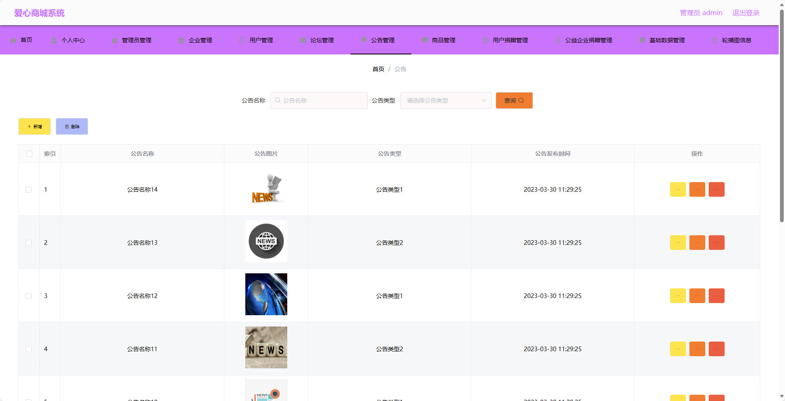

基于SpringBoot的爱心商城系统（程序+论文）
=
- 完整代码获取地址：从戎源码网 ([https://armycodes.com/](https://armycodes.com/))
- 作者微信：19941326836  QQ：952045282 
- 承接计算机毕业设计、Java毕业设计、Python毕业设计、深度学习、机器学习
- 选题+开题报告+任务书+程序定制+安装调试+论文+答辩ppt 一条龙服务
- 所有选题地址https://github.com/nature924/allProject

一、项目介绍
---
基于Spring Boot框架实现的爱心商城系统，系统包含两种角色：管理员、用户,系统分为前台和后台两大模块，主要功能如下。

### 前台模块：
- 首页：展示平台的最新动态、热门商品、公益企业捐赠信息等内容。
- 论坛：用户可以在论坛上进行交流。
- 公告：展示平台发布的公告和通知信息。
- 商品：用户可以浏览、搜索、购买商品。
- 个人中心：用户可以管理个人信息，包括修改密码、查看订单历史、捐赠记录等。

### 后台模块：
### 企业角色：
- 个人中心：企业可以管理个人信息，修改密码等。
- 论坛管理：企业可以管理论坛板块，包括审核话题、回复用户等。
- 公告管理：企业可以发布、编辑和删除公告信息。
- 商品管理：企业可以管理商品信息，包括添加、编辑和删除商品。
- 公益企业捐赠管理：企业可以管理公益企业捐赠信息，包括捐赠金额、捐赠时间等。
- 轮播图信息：企业可以管理轮播图信息，包括添加、编辑和删除轮播图。

### 管理员角色：
- 个人中心：管理员可以管理个人信息，修改密码等。
- 管理员管理：管理员可以管理其他管理员的信息，包括添加、编辑和删除管理员账号。
- 企业管理：管理员可以管理企业信息，包括添加、编辑和删除企业账号。
- 用户管理：管理员可以管理用户信息，包括添加、编辑和删除用户账号。
- 论坛管理：管理员可以管理论坛板块，包括审核话题、回复用户等。
- 公告管理：管理员可以发布、编辑和删除公告信息。
- 商品管理：管理员可以管理商品信息，包括添加、编辑和删除商品。
- 用户捐赠管理：管理员可以管理用户的捐赠记录，包括捐赠金额、捐赠时间等。
- 公益企业捐赠管理：管理员可以管理公益企业的捐赠记录，包括捐赠金额、捐赠时间等。
- 基础数据管理：管理员可以管理系统的基础数据，包括商品分类、企业类型等。
- 轮播图信息：管理员可以管理轮播图信息，包括添加、编辑和删除轮播图。

二、项目技术
---
- 编程语言：Java
- 数据库：MySQL
- 项目管理工具：Maven
- 前端技术：VUE、HTML、Jquery、Bootstrap
- 后端技术：Spring、SpringMVC、MyBatis

三、运行环境
---
- 操作系统：Windows、macOS都可以
- JDK版本：JDK1.8以上都可以
- 开发工具：IDEA、Ecplise、Myecplise都可以
- 数据库: MySQL5.7以上都可以
- Tomcat：任意版本都可以
- Maven：任意版本都可以

四、运行截图
---
### 论文截图：

### 程序截图：

